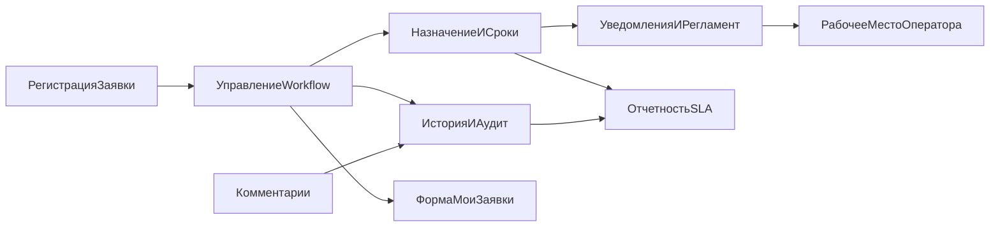

# Техническое задание: Мини-HelpDesk на платформе 1С

## 1. Общие сведения

### 1.1 Наименование
Информационная система внутреннего учета заявок `Мини-HelpDesk`.

### 1.2 Основание для разработки
Инициатива запуска pet-проекта для автоматизации обработки внутренних заявок (IT, АХО, сервис) с возможностью масштабирования в полноценный Service Desk.

### 1.3 Заинтересованные стороны
- Заказчик: внутренний владелец процесса поддержки.
- Пользователи: заявители, исполнители, операторы.
- Команда разработки: 1С-разработчик, аналитик, тестировщик (или совмещенные роли).

### 1.4 Цели проекта
- Обеспечить единый канал регистрации и обработки заявок.
- Ввести контроль сроков исполнения и прозрачность ответственности.
- Сформировать аудируемую историю изменений и коммуникации по каждой заявке.
- Получить базовую аналитическую отчетность по SLA.

## 2. Область автоматизации и границы версии 1.0

### 2.1 Входит в версию 1.0 (MVP)
- Регистрация и сопровождение заявок внутри 1С.
- Статусный workflow с назначением исполнителя.
- Комментарии и история ключевых изменений.
- Контроль просрочек регламентным заданием.
- Базовые SLA-отчеты и рабочие формы.

### 2.2 Не входит в версию 1.0
- Интеграции с почтой, мессенджерами, телефонией.
- Автоматическая маршрутизация по сложным правилам.
- Внешний веб-портал и мобильный клиент.
- Полноценная база знаний.

## 3. Термины и определения

- `Заявка` — документ, фиксирующий потребность пользователя в услуге/помощи.
- `SLA` — целевой срок выполнения заявки.
- `Оператор` — роль диспетчеризации, назначения и контроля потока заявок.
- `Исполнитель` — сотрудник, отвечающий за фактическое решение заявки.
- `Просроченная заявка` — активная заявка, у которой истек целевой срок исполнения.

## 4. Функциональная архитектура и связи подсистем

### 4.1 Подсистемы
1. Подсистема `РегистрацияЗаявок`.
2. Подсистема `УправлениеWorkflow`.
3. Подсистема `НазначениеИСроки`.
4. Подсистема `Комментарии`.
5. Подсистема `ИсторияИАудит`.
6. Подсистема `УведомленияИРегламент`.
7. Подсистема `ОтчетностьSLA`.

### 4.2 Взаимодействие подсистем

Логика связи:
- регистрация создает объект заявки и инициирует workflow;
- workflow управляет статусами и инициирует запись аудита;
- назначение и сроки используют справочники приоритетов/категорий;
- регламент контролирует просрочки и отправляет уведомления;
- отчетность получает данные из заявок и истории изменений.

## 5. Объекты конфигурации 1С

### 5.1 Справочники

#### `Пользователи`
Реквизиты:
- `Наименование`;
- `Подразделение`;
- `РольHelpDesk` (`Заявитель`, `Исполнитель`, `Оператор`, `Администратор`);
- `Email`;
- `Телефон`;
- `Активен`.

#### `КатегорииЗаявок`
Реквизиты:
- `Наименование`;
- `ГруппаКатегории` (`IT`, `АХО`, `Сервис`);
- `НормативРешенияЧасы`;
- `ТребуетПодтвержденияЗакрытия` (булево, опционально для 1.1).

#### `Приоритеты`
Реквизиты:
- `Наименование` (`Низкий`, `Средний`, `Высокий`, `Критический`);
- `ВесСортировки`;
- `НормативРеакцииЧасы`;
- `НормативРешенияЧасы`.

### 5.2 Перечисления
`СтатусыЗаявки`:
- `Новая`;
- `ВРаботе`;
- `Ожидание`;
- `Закрыта`;
- `Отклонена`.

### 5.3 Документы

#### `Заявка`
Ключевые реквизиты:
- `Дата`, `Номер`;
- `Заявитель`, `Автор`;
- `Категория`, `Приоритет`;
- `Тема`, `Описание`;
- `Статус`;
- `Исполнитель`;
- `СрокРеакции`, `СрокИсполнения`;
- `ДатаПринятияВРаботу`, `ДатаЗакрытия`;
- `ПричинаОтклонения`;
- `ПризнакПросрочки`.

#### `КомментарийПоЗаявке`
Ключевые реквизиты:
- `Заявка`;
- `Автор`;
- `ДатаКомментария`;
- `ТекстКомментария`;
- `Служебный`.

### 5.4 Регистр сведений
`ИсторияИзмененийЗаявок`
- Измерения: `Заявка`, `МоментИзменения`, `Пользователь`.
- Ресурсы/реквизиты: `Событие`, `Поле`, `СтароеЗначение`, `НовоеЗначение`, `КомментарийСистемы`.

## 6. Функциональные требования

### 6.1 Создание заявки
- Система должна позволять создание заявки пользователем роли `Заявитель`.
- При создании автоматически устанавливается `Статус = Новая`.
- Срок исполнения рассчитывается по приоритету с учетом категории.
- В историю изменений записывается событие `Создание`.

### 6.2 Обработка заявки
- Оператор должен назначать исполнителя и менять приоритет.
- Исполнитель должен переводить заявку в `ВРаботе`, `Ожидание`, `Закрыта`.
- Смена статуса допускается только по утвержденным переходам.
- При закрытии обязателен минимум один комментарий исполнителя.

### 6.3 Работа с комментариями
- Комментарии должны быть доступны в карточке заявки хронологической лентой.
- Для каждого комментария фиксируются автор, дата, тип (пользовательский/служебный).
- Добавление комментария не должно изменять статус автоматически (если не указано явно действием пользователя).

### 6.4 Аудит и история
- Система должна логировать изменения полей: `Статус`, `Исполнитель`, `Приоритет`, `СрокИсполнения`.
- Записи истории должны быть доступны для просмотра оператору и администратору.

### 6.5 Контроль сроков и уведомления
- Регламентное задание должно запускаться каждые 30 минут.
- При просрочке система выставляет `ПризнакПросрочки = Истина`.
- При первом факте просрочки отправляется уведомление исполнителю и оператору.

### 6.6 Отчеты
- Отчет `SLAВовремяИПросрочено` за период с разрезами по категориям, приоритетам, исполнителям.
- Отчет `НагрузкаИсполнителей` по открытым заявкам.
- Отчет `СтатуснаяВоронка` по текущему распределению статусов.

## 7. Логика процесса (workflow и правила)

### 7.1 Таблица допустимых переходов
- `Новая -> ВРаботе`.
- `Новая -> Отклонена`.
- `ВРаботе -> Ожидание`.
- `ВРаботе -> Закрыта`.
- `ВРаботе -> Отклонена`.
- `Ожидание -> ВРаботе`.
- `Ожидание -> Отклонена`.

### 7.2 Ограничения переходов
- В `ВРаботе` нельзя перевести без заполненного `Исполнителя`.
- В `Закрыта` нельзя перевести без комментария исполнителя.
- В `Отклонена` обязательно заполнение `ПричинаОтклонения`.
- После перехода в `Закрыта` или `Отклонена` редактирование основных полей запрещено (кроме администратора).

### 7.3 SLA-формулы версии 1.0
- `ПланИсполнения = ДатаСоздания + НормативРешенияЧасы`.
- `Просрочена = (ТекущаяДата > ПланИсполнения) И (Статус НЕ Закрыта/Отклонена)`.
- `ФактSLA = ВСрок`, если `ДатаЗакрытия <= ПланИсполнения`, иначе `Просрочено`.

## 8. Интерфейсы и UX-требования

### 8.1 Рабочее место оператора
- Список заявок с преднастроенными фильтрами:
  - `Новые`;
  - `ВРаботе`;
  - `Просроченные`;
  - `БезИсполнителя`;
  - `Мои`.
- Групповые операции: назначение исполнителя, смена приоритета.
- Цветовая индикация: высокий приоритет, просрочка.

### 8.2 Форма `МоиЗаявки`
- Для заявителя: отображаются только его заявки.
- Для исполнителя: отображаются заявки, где он исполнитель.
- Быстрое добавление комментария без открытия полного режима редактирования.

### 8.3 Канбан/альтернативный список
- Колонки по статусам.
- Для MVP разрешены кнопочные переходы вместо drag-and-drop.

## 9. Роли и матрица прав

- `Заявитель`: создание, просмотр своих, комментарии к своим.
- `Исполнитель`: просмотр назначенных, изменение допустимых статусов, комментарии.
- `Оператор`: полный оперативный доступ ко всем заявкам.
- `Администратор`: настройка НСИ, прав, регламентных заданий, доступ к сервисным функциям.

Дополнительно:
- удаление заявок в продуктивной среде запрещено всем ролям;
- физическое удаление комментариев запрещено, допустимо только логическое помечание.

## 10. Нефункциональные требования

- Платформа: 1С:Предприятие 8.3 (актуальный релиз проекта).
- Производительность: открытие списка до 5 секунд при объеме до 30 000 заявок.
- Надежность: регламентное задание должно быть идемпотентным при повторном запуске.
- Безопасность: разграничение доступа на уровне ролей и объектов.
- Поддерживаемость: все ключевые бизнес-правила вынесены в явно именованные процедуры/модули.

## 11. Интеграции и внешние зависимости

Для версии 1.0 внешние интеграции не требуются.
Опциональные точки расширения (версия 1.1+):
- SMTP для email-уведомлений;
- обмен с AD/LDAP для синхронизации пользователей;
- webhook в корпоративный мессенджер.

## 12. Тестирование и приемка

### 12.1 Уровни тестирования
- Smoke после каждого этапа.
- Функциональное тестирование по сценариям.
- UAT с представителем заказчика.

### 12.2 Обязательные тест-сценарии
1. Создание заявки заявителем.
2. Назначение исполнителя оператором.
3. Полный цикл: `Новая -> ВРаботе -> Закрыта`.
4. Сценарий ожидания: `ВРаботе -> Ожидание -> ВРаботе`.
5. Просрочка и уведомление по регламенту.
6. Проверка невозможности недопустимого перехода.
7. Проверка логирования всех ключевых изменений.
8. Проверка отчетов на тестовом наборе данных.

### 12.3 Критерии приемки версии 1.0
- Реализованы все функциональные требования раздела 6.
- Пройдены 100% критичных тестов и не менее 95% общего тест-пула.
- Роли пользователей работают согласно матрице прав.
- Заказчик подтверждает эксплуатационную пригодность на пилоте.

## 13. План реализации по этапам (для старта разработки)

### Этап 0. Подготовка (2-3 дня)
- Утверждение ТЗ.
- Подготовка пустой конфигурации/ветки разработки.
- Наполнение минимального НСИ (пользователи, категории, приоритеты).

### Этап 1. Ядро заявок и workflow (1 неделя)
- Создание метаданных `Заявка` и `СтатусыЗаявки`.
- Форма заявки и список.
- Переходы статусов и валидации.

### Этап 2. Назначения, сроки, просрочки (1 неделя)
- Назначение исполнителя и SLA-сроков.
- Признак просрочки.
- Регламентное задание контроля просрочек.

### Этап 3. Комментарии и аудит (1 неделя)
- Документ `КомментарийПоЗаявке`.
- Лента комментариев в карточке.
- Регистр истории изменений.

### Этап 4. Отчеты и пилот (1 неделя)
- Реализация SLA-отчетов.
- Фиксация дефектов и доработка.
- Пилот на ограниченной группе пользователей.

## 14. Управление рисками

- Риск: неутвержденные правила статусов.  
  Мера: зафиксировать и подписать таблицу переходов до начала кодирования.
- Риск: частые изменения SLA-правил.  
  Мера: хранить SLA-нормативы в НСИ, а не в коде.
- Риск: низкое качество исходных данных пользователей.  
  Мера: назначить владельца НСИ и провести верификацию перед пилотом.
- Риск: перегрузка оператора на старте.  
  Мера: добавить быстрые фильтры и групповые операции в приоритет.

## 15. Артефакты проекта

К началу разработки должны быть готовы:
- согласованное ТЗ (этот документ);
- backlog задач по этапам с приоритетами;
- матрица ролей и прав;
- набор тест-кейсов UAT;
- короткие инструкции для ролей `Заявитель`, `Исполнитель`, `Оператор`.

## 16. Бэклог развития после версии 1.0

- Email- и чат-уведомления.
- Автоназначение исполнителя по категории.
- База знаний и шаблоны решений.
- Подтверждение закрытия заявителем.
- Метрики реакции (FRT) и пользовательской удовлетворенности.
